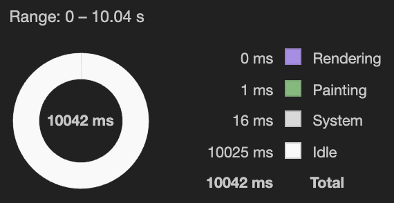
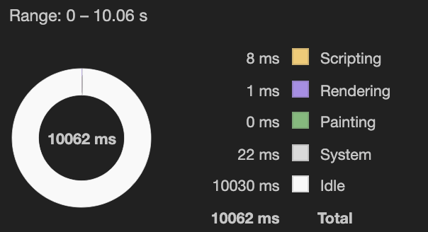

# Animate PNGs with Transparency

## Run examples

```sh
npm install && npm run start
```

Examples:

* [Sprite animated with CSS](http://localhost:5000/sprite_css)
* [Sprite animated with Canvas](http://localhost:5000/sprite_canvas)
* [Animated PNG](http://localhost:5000/apng) (https://caniuse.com/?search=apng)
* [WebM/AV1 - HEVC](http://localhost:5000/video) (https://caniuse.com/?search=webm oder https://caniuse.com/?search=av1 und Fallback Safari: https://caniuse.com/?search=HEVC)

## Time / Frame calculation example

6 seconds / 100 frames = 0.06 seconds for each frame

How many frames in one second = 1 / 0.06 = 16.666 frames

## Rendering performance measure

* Canvas 3x-5x faster than rendering sprite
* APNG and Video doesn't need rendering time from the browser

### Sprite CSS


### Sprite Canvas


### APNG



Support: https://caniuse.com/?search=apng
Canvas polyfill for IE11 possible: https://github.com/davidmz/apng-canvas

How to generate the file format:

* https://ezgif.com/apng-maker (Web, single frames or sprite)
* https://sourceforge.net/projects/apngasm/files/2.91/ (CLI)
* https://github.com/shgodoroja/APNGb (UI)
* https://www.reto-hoehener.ch/japng/ (UI or CLI)
* https://github.com/akalverboer/canvas2apng (Library to export canvas to APNG)

### WebM/AV1 - HEVC



Support: WebM (VP9) or AV1 and HEVC as fallback for Safari >= 11 & Mac OS High Sierra

https://ffmpeg.org/documentation.html
https://trac.ffmpeg.org/wiki/Encode/AV1
https://trac.ffmpeg.org/wiki/Encode/H.265

How to generate the video files:

WebM:

```sh
ffmpeg -framerate 16.666 -i frames/tile%3d.png -c:v libvpx-vp9 -pix_fmt yuva420p movie.webm
```

if no audio is wished, also pass `-an` option.

For HEVC we first have to create this .mov file:

```sh
ffmpeg -framerate 16.666 -i frames/tile%3d.png -c:v prores_ks -pix_fmt yuva444p10le -alpha_bits 16 -profile:v 4444 -f mov -vframes 150 movie.mov
```

Then use "Encode Selected Video Files" on movie.mov file on MacOS >= Catalina finder or use this command:

```sh
avconvert --preset PresetHEVC1920x1080WithAlpha --source source.mov --output output.m4v
```


## Sumup / Notable differences

* Video is by far the best considering file size, but watchout for browser support (no IE support, fallback for Safari)
* Video export seems to change the colors of the frames (keep in mind if you want to use a poster image)
* When switching tabs, sprite css loses some frames and the whole page flickers, doesn't happen with other solutions
* CSS Sprite and Canvas both render when not in view (IntersectionObserver needed), APNG stops by default
* All seem to stop rendering when tab is not visible (still focus/bluring window could be implemented when window is background)

## Credits

Thanks [@christophdubach](https://github.com/christophdubach) and [@tobiasfrei](https://github.com/tobiasfrei) for proposing ideas and showing pitfalls.
